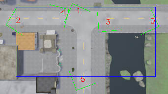
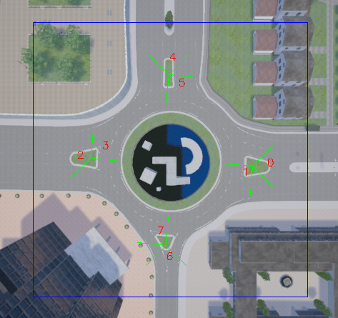

# Cooperative 3D Object Detection using Infrastructure Sensors

This is the official implementation of the paper [Cooperative Perception for 3D Object Detection in Driving Scenarios Using Infrastructure Sensors](https://ieeexplore.ieee.org/abstract/document/9228884).
The pre-print version can be found [here](https://arxiv.org/pdf/1912.12147.pdf).


If you use our dataset or parts of this code, please cite our work
```
@article{arnold_coop3dod,
author={Arnold, Eduardo and Dianati, Mehrdad and de Temple, Robert and Fallah, Saber},
journal={IEEE Transactions on Intelligent Transportation Systems},
title={Cooperative Perception for 3D Object Detection in Driving Scenarios Using Infrastructure Sensors},
year={2020},
pages={1-13},
doi={10.1109/TITS.2020.3028424}
}
```

## :gear: Installation

### Dependencies

Install the dependencies using `conda env create -f environment.yml`. 
Note that this code was tested with:

- Linux (tested on Ubuntu 18.04 )
- Python 3.6
- PyTorch 0.4.0 and torchvision
- CUDA toolkit 9.0


### Build CUDA extensions

```shell
cd lib/extensions/_nms
sh build.sh
```

### Download Dataset and pretrained models

1. Please download our cooperative dataset for infrastructure sensors [here](https://drive.google.com/file/d/1tlUelCVcMX9H2i60zrPdLS4yywa5gTmS/view?usp=sharing). Extract the contents in the `assets/dataset` folder.

2. If desired, download our pre-trained models for the T-junction and Roundabout scenarios [here](https://drive.google.com/file/d/1iVBYGxqSt8EmqmYveeag49cRZvC_r0Y4/view?usp=sharing). Extract the contents in the `assets/saved_models` folder.

## :camera: Dataset details
The dataset was created using the [CARLA](https://carla.org/) autonomous driving simulation tool.It contains colour and depth images of multiple cameras installed in a 'infrastructure' setting.
There are four independent collections, two for a T-junction scenario and two for a roundabout scenario.
Each collection contains a number of frames, where each frame contains the synchronised colour/depth images from different sensors and the 3D bounding box annotation for vehicles, cyclists and pedestrians.
Note that the number and pose of sensors is constant for each collection and identical for each scenario, i.e. 6 sensors for the T-junction scenario and 8 sensors for the roundabout scenario.
Each collection file also contains the intrinsic and extrinsic parameters of each camera. 
You may visualise the raw data using `visualise_dataset.py assets/dataset/col{number}.hdf5`. Use the `-p` argument to visualise backprojected point clouds.

Details of each collection:
- col3.h5py - T-junction scenario, 4000 independent frames used for training
- col4.h5py - T-junction scenario, 1000 independent frames for testing
- col5.h5py - Roundabout scenario, 4000 independent frames used for training
- col6.h5py - Roundabout scenario, 1000 independent frames for testing

The pose of the cameras in each scenario is indicated by the green lines the top-down views below. Note that each camera has a unique ID.
The blue rectacles indicate the detection area extents for each scenario.



## :woman\_teacher: Training
The depth maps from each camera are backprojected to 3D using the intrinsic camera matrix and transformed to the global coordinate system using the extrinsic camera matrix.
Two indepedent models are trained, one for each scenario, using the fused point clouds from all sensors.
The training hyper-parameters can be configured in the respective configuration script.
The model can be trained using

```
python train.py --config config/{roundabout|tjunc}.json
```

A model checkpoint will be created after each epoch at `assets/saved_models/`.

## :chart: Evaluation
To evaluate a trained model, use
```
python eval.py --config config/{roudabout|tjunc}.json --checkpoint assets/saved_models/{model_checkpoint}.pth
```

We provide the model checkpoints for the T-Junction and Roundabout scenarios used for the evaluation in the paper.
To evaluate the pre-trained models, use:
```
python eval.py --config config/tjunc.json --checkpoint assets/saved_models/checkpoint_TJunc.pth
python eval.py --config config/roudabout.json --checkpoint assets/saved_models/checkpoint_Roundabout.pth
```

The batch size can be manually set using `-b N`.

By default all cameras available in the given scenario are used.
To select a subset of cameras to be used in the sensor fusion use the `--cameras` argument.
For example, to select the cameras 0,1,2, one would use `--cameras 012`.
The cameras IDs can be identified in the Figure on the dataset details section.

## :octocat: Acknowledgements
This implementation is heavily based on the [Voxelnet](https://arxiv.org/abs/1711.06396) implemenation of [Yc174](https://github.com/Yc174/voxelnet).
